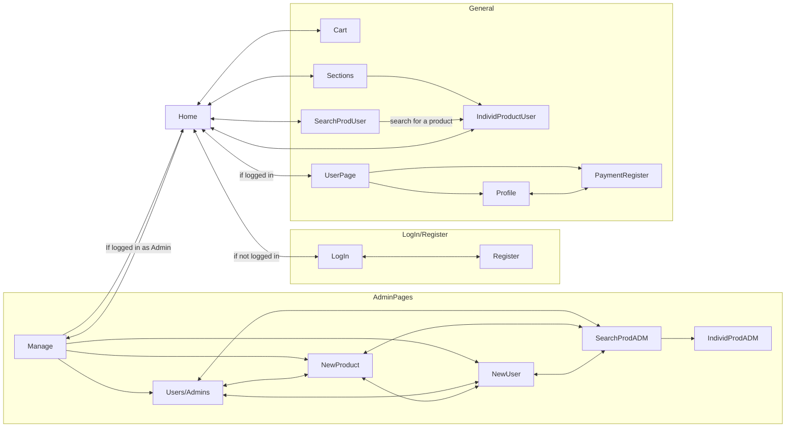

# Grocery Store - Web Project

Group 17:

- Arthur Trottmann Ramos - 14681052
- Henrique Drago - 14675441
- Henrique Yukio Sekido - 14614564

## Requirements

There're some requirements for the system, such as:

- The system must have 2 types of users: Clients and Administrators. Administrators are responsible for registering/managing administrators, customers, and products/services provided. The application already comes with an account admin with password admin. Customers are users who access the system to buy products/services.
  
- The admin record includes, at least: name, id, phone, email.
  
- Each customer's record includes, at least: name, id, address, phone, email
  
- Product/services records include, at least: name, id, photo, description, price, quantity (in stock), and quantity sold.
  
- Selling Products (or services): Products are selected, their quantity chosen, and are included in a cart. Products are purchased using a credit card number (any number is accepted by the system). The quantity of product sold is subtracted from the quantity in stock and added to the quantity sold. Carts are emptied only on payment or by customers.

- Product/Service Management: Administrators can create/update/read/delete (crud) new products and services. For example, they can change the stock quantity.
  
- Your functionality: For each food item, the site will pair it with another item in the cart and generate a recipe.

- The system must provide accessibility requirements and provide good usability. The system must be responsive, meaning that it should complete assigned tasks within a reasonable time.

## Project Description

This project implements a web page (front-end and back-end) for a grocery store. The site has the following functionalities:

- Add an item and its quantity to the cart

- Purchase items

- Create an account as a customer or an admin

- Edit items

- Generate a recipe based on items in the cart

The mock-ups are:
- [Sign up](Milestone1/images/SignIn.png)
 
- [Sign in](Milestone1/images/SignUp.png)

- [CRUD Page](Milestone1/images/CRUD.jpeg)

- [User Page](Milestone1/images/Profile.png)

- [Cart Page](Milestone1/images/Cart.png)

- [Section Page](Milestone1/images/Section.jpeg)

- Product Page: [HTML](Milestone1/html/product-page.html) | [CSS](Milestone1/css/product-page.css)

- Landing Page: [HTML](Milestone1/html/pagina-inicial.html) | [CSS](Milestone1/css/pagina-inicial.css)

- Add ADM or Product Page: [HTML](Milestone1/html/pagina-de-registro.html) | [CSS](Milestone1/css/pagina-de-registro.css)

Regarding the information we will store on the server, we will need to save both clients' and administrators' personal information, such as name, ID, address, phone number, and email. Additionally, we will store product information, including name, price, number of items sold, items in stock, image, and brand. 

## Comments About the Code

## Test Plan

## Test Results

## Build Procedures

To use this project, follow the instructions below:

- Clone the repository.

- Go to grocery-store-react by "cd grocery-store-react".

- Give "npm i".

- Give "npm start".

## Problems

## Comments
