# 🛒 Mercado Verde — Online Grocery Store

A full-stack e-commerce web application for an online grocery store, built with **React**, **Node.js**, and **MongoDB**. The platform supports two user roles (customers and administrators), a shopping cart system, and an AI-powered recipe generator based on cart items.

> **Academic Project** · Web Development Course · Group 17  
> University of São Paulo (USP) — ICMC

---

## 👥 Team

| Name | USP ID |
|---|---|
| Arthur Trottmann Ramos | 14681052 |
| Henrique Drago | 14675441 |
| Henrique Yukio Sekido | 14614564 |

---

## ✨ Features

- **Customer accounts** — register, log in, manage profile and payment info
- **Admin dashboard** — full CRUD for products, customers, and administrators
- **Shopping cart** — add products, adjust quantities, and checkout with a credit card number
- **Stock management** — stock quantity decrements and sold quantity increments on purchase
- **AI Recipe Generator** — generates a recipe based on the products currently in the cart (powered by OpenRouter LLM API)
- **Responsive UI** — accessible and usable across different screen sizes

---

## 🗺️ Application Architecture

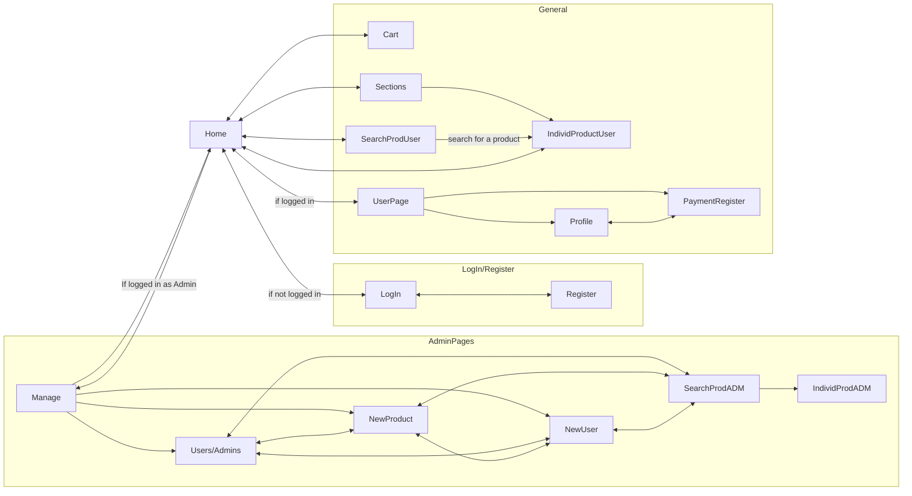
```mermaid
flowchart LR
  subgraph AdminPages
    Manage --> Users/Admins & NewProduct & NewUser
    Users/Admins <--> NewProduct & NewUser & SearchProdADM
    NewProduct <--> NewUser & SearchProdADM
    NewUser <--> SearchProdADM
    SearchProdADM --> IndividProdADM
  end

  subgraph LogIn/Register
    LogIn <--> Register
  end

  subgraph General
    Cart
    Sections --> IndividProductUser
    UserPage --> Profile & PaymentRegister
    Profile <--> PaymentRegister
    SearchProdUser --> |search for a product| IndividProductUser
  end

  Home --> |If logged in as Admin| Manage
  Manage --> Home
  Home <--> Sections
  Home <--> IndividProductUser
  Home <--> SearchProdUser
  Home <--> Cart
  Home <--> |if logged in| UserPage
  Home <--> |if not logged in| LogIn
```

---

## 🛠️ Tech Stack

| Layer | Technology |
|---|---|
| Frontend | React |
| Backend | Node.js / Express |
| Database | MongoDB |
| AI Integration | OpenRouter API |

---

## 🚀 Getting Started

### Prerequisites

- Node.js and npm installed
- MongoDB running locally or a connection string
- An [OpenRouter](https://openrouter.ai/) API key (required for the recipe feature)

### Installation

1. **Clone the repository**

```bash
git clone https://github.com/ArthurTRamos/Grocery-Store---Web-Project.git
cd Grocery-Store---Web-Project
```

2. **Install frontend dependencies**

```bash
cd mercado-verde
npm install
```

3. **Set up the API key**

Inside `mercado-verde/src/`, create a folder named `data` and add a file called `key.json` with the following structure:

```json
[
  {
    "key": "YOUR_OPENROUTER_API_KEY"
  }
]
```

> Leave the `"key"` field empty (`""`) if you don't want to use the recipe feature.

4. **Start the frontend**

```bash
cd ../../
npm run dev
```

5. **Start the backend** (in a separate terminal)

```bash
cd backend
npm i
npm start
```

6. Open the URL shown in the frontend terminal in your browser.

---

## 🔐 Default Admin Account

Use the following credentials to access the admin dashboard:

| Field | Value |
|---|---|
| Email | `admin@yahoo.br` |
| Password | `admin` |

---

## 📋 Data Model

**Administrators:** name, ID, phone, email

**Customers:** name, ID, address, phone, email

**Products/Services:** name, ID, photo, description, price, stock quantity, quantity sold

---

## 🧪 Test Coverage (Manual)

All core flows were tested manually:

| Scenario | Result |
|---|---|
| Buy a product | ✅ Stock decremented, sold count incremented |
| Create a new product | ✅ Product visible in catalogue |
| Edit a product (name, image) | ✅ Changes reflected site-wide |
| Create a new user | ✅ Account accessible after registration |
| Edit a user | ✅ Profile updated correctly |
| Register / Login | ✅ Authentication working |
| Generate a recipe | ✅ Recipe created from cart items |
| Delete a product | ✅ Removed from catalogue |
| Delete a user | ✅ Removed from admin panel |

### Sample Test Screenshots

<details>
<summary>📦 Buy a product — "Arroz Integral 1kg"</summary>

Before purchase (20 sold / 45 in stock), then after purchasing all stock (65 sold / 0 in stock).

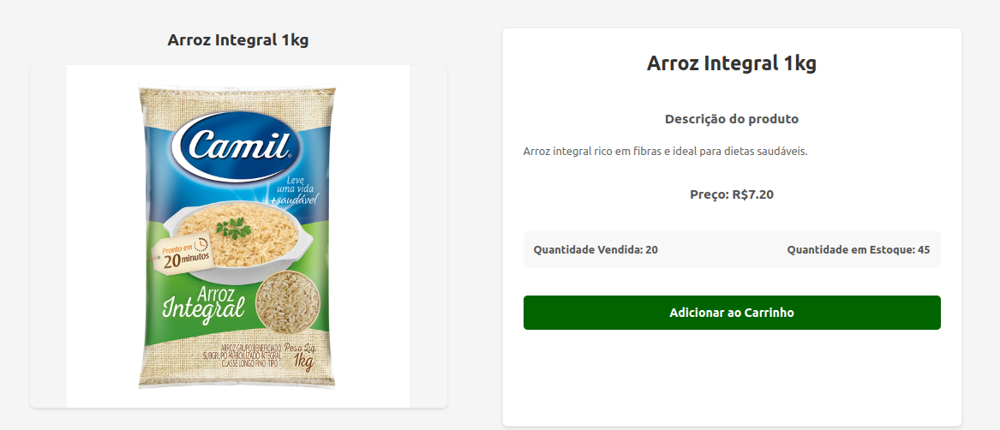
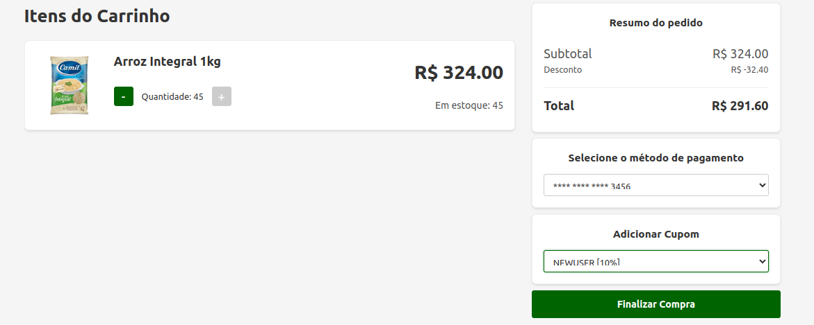
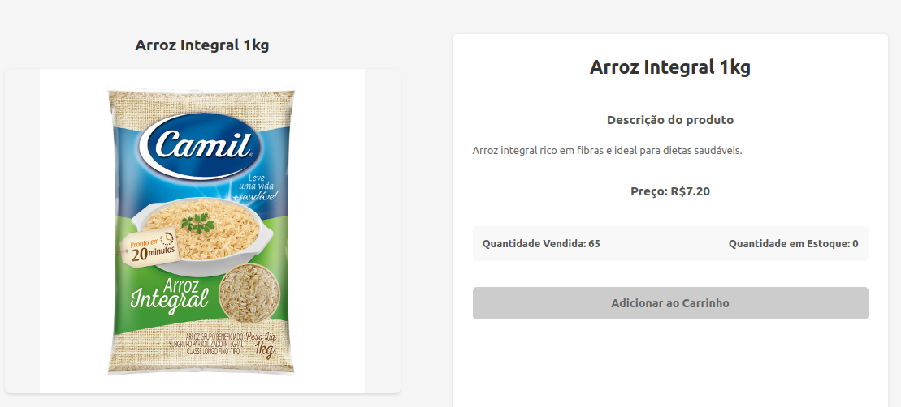
</details>

<details>
<summary>➕ Create a new product — "Bala"</summary>

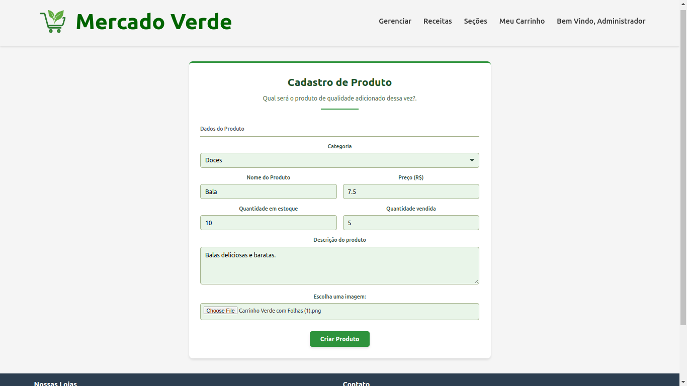
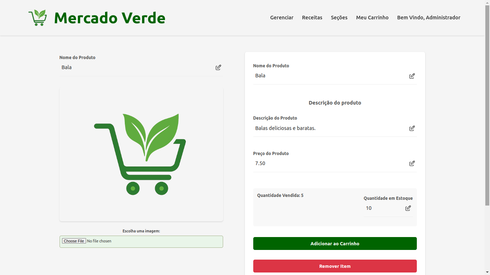
</details>

<details>
<summary>✏️ Edit a product — "Arroz Integral 1kg"</summary>

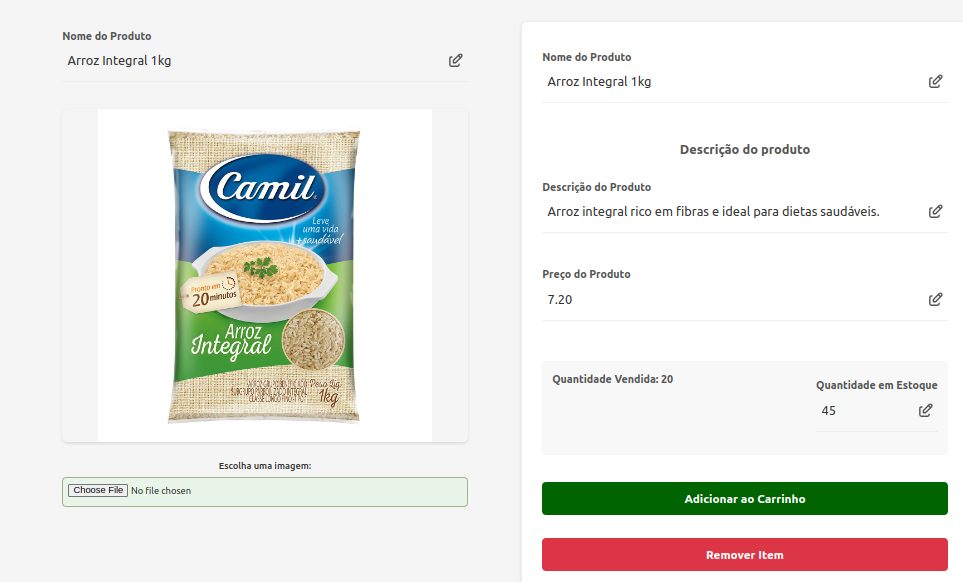
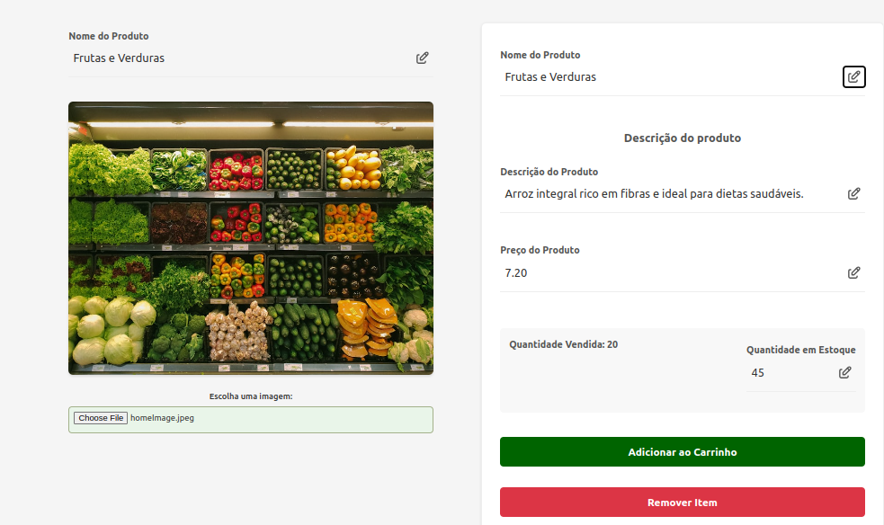
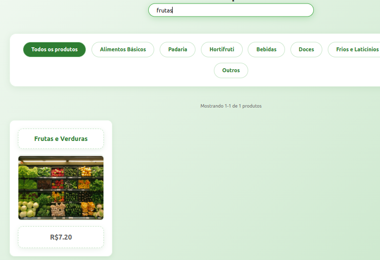
</details>

<details>
<summary>👤 Edit a user — "Joãozinho da Silva Sauro"</summary>

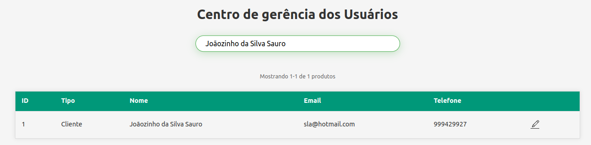
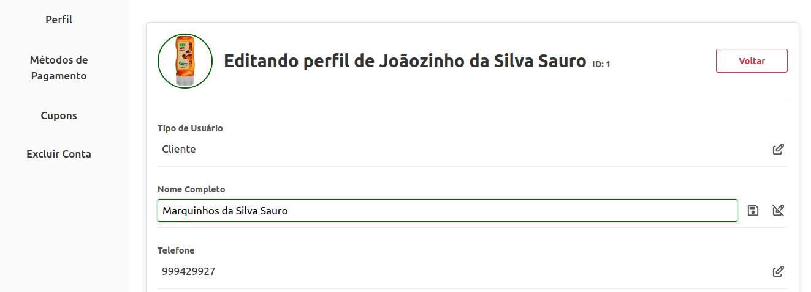
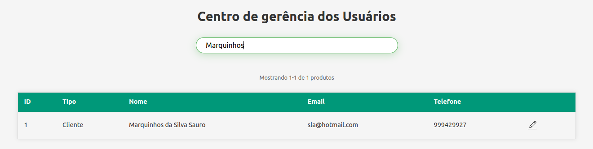
</details>

<details>
<summary>🔑 Register and Login — "Arthur Ramos"</summary>

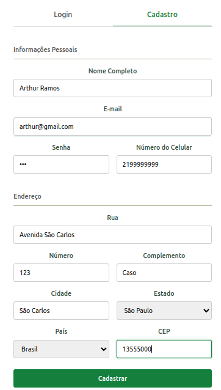
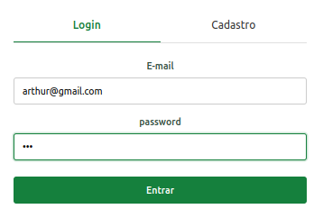
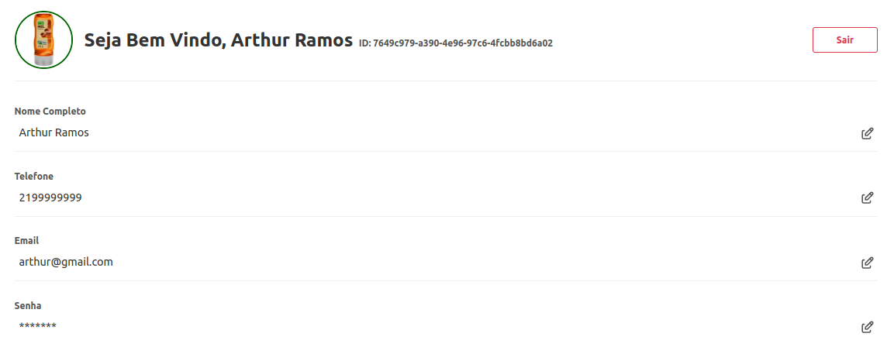
</details>

<details>
<summary>🍽️ Generate a recipe — "Almoço de Domingo"</summary>

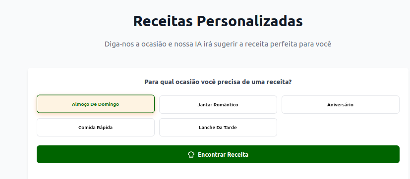
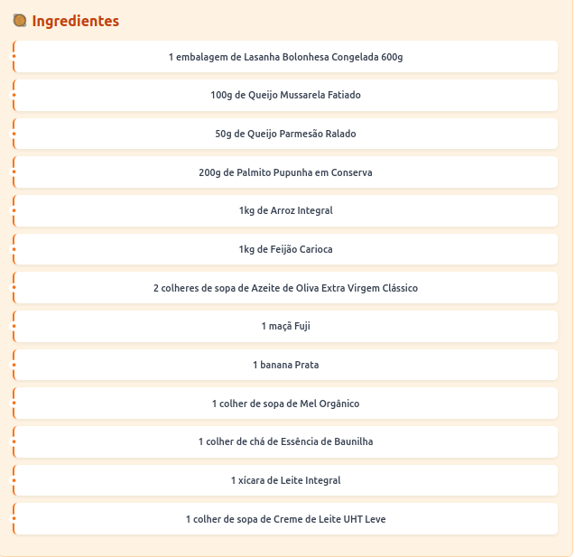
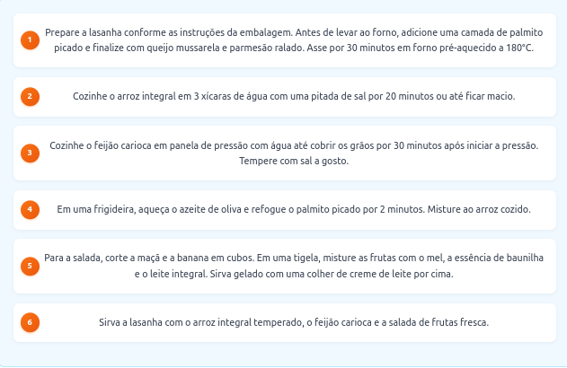
</details>

<details>
<summary>🗑️ Delete a product</summary>


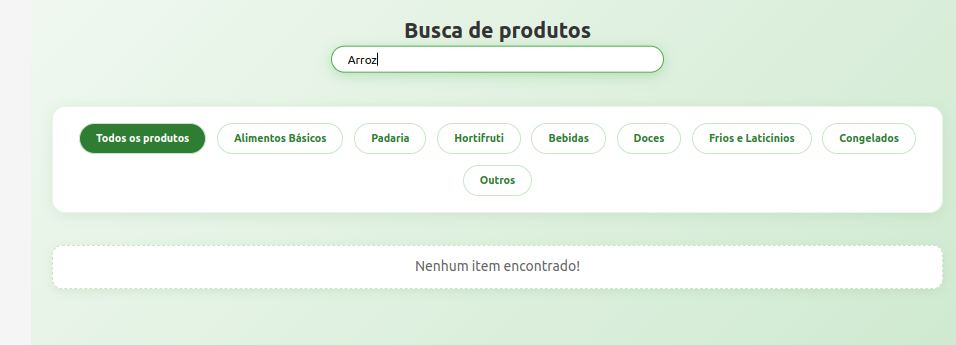
</details>

<details>
<summary>🗑️ Delete a user — "Joãozinho da Silva Sauro"</summary>

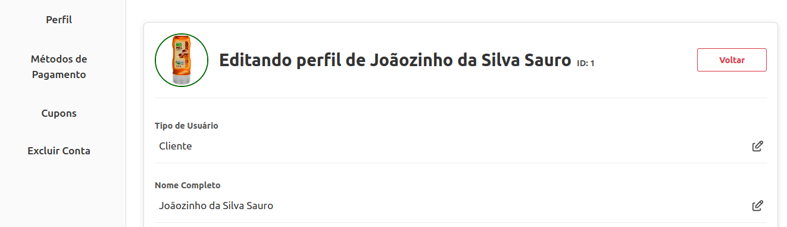
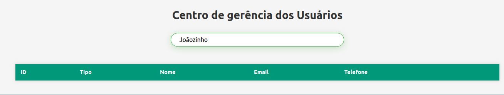
</details>

---

## 📐 UI Mockups (Milestone 1)

| Screen | Link |
|---|---|
| Sign Up | [View](Milestone1/images/SignIn.png) |
| Sign In | [View](Milestone1/images/SignUp.png) |
| CRUD Page | [View](Milestone1/images/CRUD.jpeg) |
| User Profile | [View](Milestone1/images/Profile.png) |
| Cart | [View](Milestone1/images/Cart.png) |
| Section Page | [View](Milestone1/images/Section.jpeg) |
| Product Page | [HTML](Milestone1/html/product-page.html) · [CSS](Milestone1/css/product-page.css) |
| Landing Page | [HTML](Milestone1/html/pagina-inicial.html) · [CSS](Milestone1/css/pagina-inicial.css) |
| Add Admin/Product | [HTML](Milestone1/html/pagina-de-registro.html) · [CSS](Milestone1/css/pagina-de-registro.css) |

---

## ⚠️ Notes

- The **recipe generation** feature requires a valid [OpenRouter](https://openrouter.ai/) API key. Create a free account, generate a key, and paste it into `key.json` as described in the setup steps.
- The system accepts any credit card number for checkout (no real payment processing).
