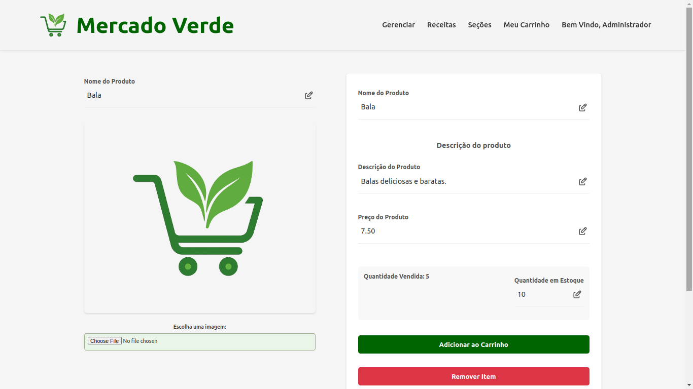
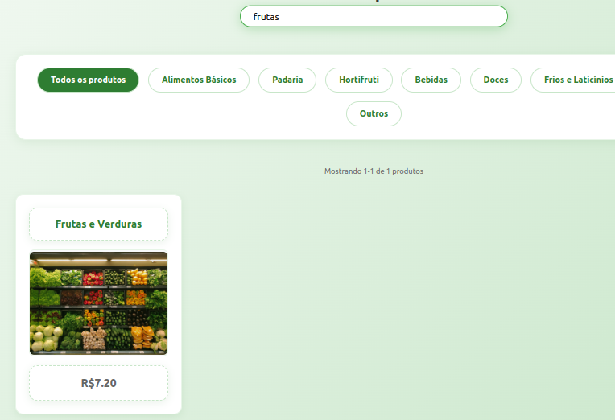

# Grocery Store - Web Project

Group 17:

- Arthur Trottmann Ramos - 14681052
- Henrique Drago - 14675441
- Henrique Yukio Sekido - 14614564

## Requirements

There're some requirements for the system, such as:

- The system must have 2 types of users: Clients and Administrators. Administrators are responsible for registering/managing administrators, customers, and products/services provided. The application already comes with an account admin with password admin. Customers are users who access the system to buy products/services.
  
- The admin record includes, at least: name, id, phone, email.
  
- Each customer's record includes, at least: name, id, address, phone, email
  
- Product/services records include, at least: name, id, photo, description, price, quantity (in stock), and quantity sold.
  
- Selling Products (or services): Products are selected, their quantity chosen, and are included in a cart. Products are purchased using a credit card number (any number is accepted by the system). The quantity of product sold is subtracted from the quantity in stock and added to the quantity sold. Carts are emptied only on payment or by customers.

- Product/Service Management: Administrators can create/update/read/delete (crud) new products and services. For example, they can change the stock quantity.
  
- Your functionality: the site will take every site's products and it will generate a recipe.

- The system must provide accessibility requirements and provide good usability. The system must be responsive, meaning that it should complete assigned tasks within a reasonable time.

## Project Description

This project implements a web page (front-end and back-end) for a grocery store. The site has the following functionalities:

- Add an item and its quantity to the cart

- Purchase items

- Create an account as a customer or an admin

- Edit items

- Generate a recipe based on items in the cart


The mock-ups are:
- [Sign up](Milestone1/images/SignIn.png)
 
- [Sign in](Milestone1/images/SignUp.png)

- [CRUD Page](Milestone1/images/CRUD.jpeg)

- [User Page](Milestone1/images/Profile.png)

- [Cart Page](Milestone1/images/Cart.png)

- [Section Page](Milestone1/images/Section.jpeg)

- Product Page: [HTML](Milestone1/html/product-page.html) | [CSS](Milestone1/css/product-page.css)

- Landing Page: [HTML](Milestone1/html/pagina-inicial.html) | [CSS](Milestone1/css/pagina-inicial.css)

- Add ADM or Product Page: [HTML](Milestone1/html/pagina-de-registro.html) | [CSS](Milestone1/css/pagina-de-registro.css)

Regarding the information we will store on the server, we will need to save both clients' and administrators' personal information, such as name, ID, address, phone number, and email. Additionally, we will store product information, including name, price, number of items sold, items in stock, image, and brand. 

## Comments About the Code

No comments about the code.

## Test Plan

We didn't use testing tools. For the manual tests, we tried:

- Buy a product

- Create a new product

- Create a new user

- Modify a product

- Modify a user

- Register/login

- Generate a recipe

- Delete a product or user

## Test Results

### Buy the product "Arroz Integral 1kg": 

We have the following pages: product before the buy, cart and product after the buy.

Initially, there were 20 products sold and 45 in stock. After purchasing all the stock, the quantity sold was 65 and the quantity in stock was 0.


### Create the new product "Bala":

We have the following pages: create product and individual product (after creation).





### Modify the image and name of the product "Arroz Integral 1kg":

We have the following pages: product before the modification, product after the modification and section with the modified product.




### Modify a user:

We gonna modify the name of user "Joãozinho da Silva Sauro". We the the following pages: users manage center and profile (admin).


### Register/Login:

We have the following pages: register tab, login tab and profile after login.

We created a user called "Arthur Ramos".


### Generate a recipe for "Almoço de Domingo":

We have the following pages: generate recipe, ingredientes and steps.


### Delete a product:

We have the following pages: product and sections.


### Delete a user:

We gonna delete the user "Joãozinho da Silva Sauro". We have the following pages: profile (admin) and users manage center.


## Build Procedures

To use this project, follow the instructions below:

- Clone the repository.

```
git clone https://github.com/ArthurTRamos/Grocery-Store---Web-Project.git
```

- Go to grocery-store-react by

```
cd mercado-verde
```

- Type

```
npm install
```

- Go to ```cd src```, create the folder ```data``` and create the file ```key.json``` inside of it with the following structure:

```
[
    {
        "key": ""
    }
]
```

- Return to mercado-verde with

```
cd ../../
```

- Type

```
npm run dev
```

- Open another terminal and go to ```cd backend```. Type ```npm i``` and ```npm start```.

- Come back to the first terminal, take the url link and put it on your browser search bar.

## Accounts

If you want to test the website, use the following account for admin:
- admin@yahoo.br (email) / admin (password)

## Problems

No problems.

## Comments

If you want to use the recipe funcionality, you have to go to <a href="https://openrouter.ai/">this website</a>, create an account and create a key. After this, insert the key on the ```key.json```.
